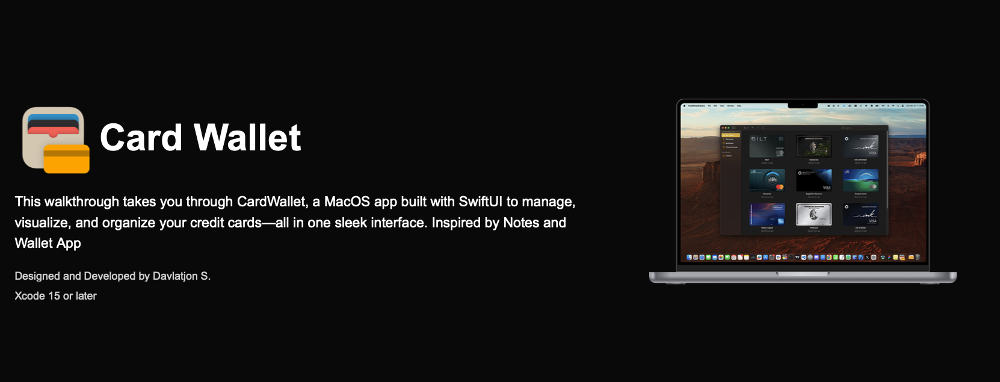
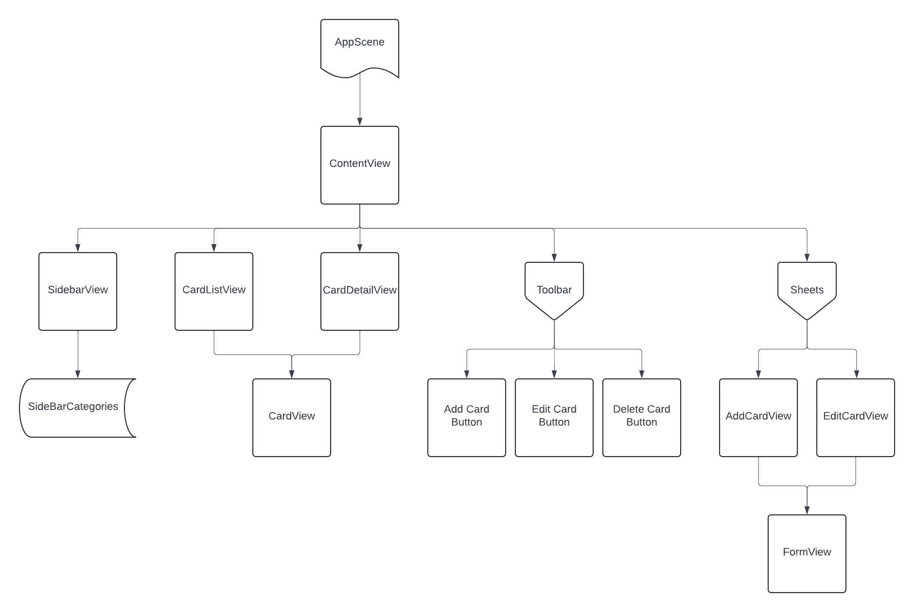
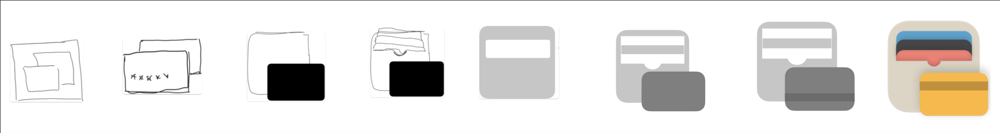

## 💳 Card Wallet (macOS App)

> A native SwiftUI app to manage, track, and visualize your credit card portfolio with powerful insights and an intuitive UI.


## Table of Contents

- [About the Project](#about-the-project)
- [Walkthrough](#walkthrough)
- [Features](#features-section)
- [Initial Design Concepts](#initial-design-concepts-section)
- [Planned Features](#planned-features)
- [View Heirarchy](#view-heirarchy)

---

<h2 id="about-the-project">✨ About the Project</h2>

**Card Wallet** is a macOS app built using **SwiftUI** and **SwiftData**, designed to help you keep track of all your credit cards — from credit limits and annual fees to sign-up bonuses and promotional APRs.

This started as a personal project to organize a growing number of cards, and has since evolved into a full-featured app with native macOS behavior, rich visuals, and extensibility in mind.

---

<h2 id="walkthrough">🪧 Walkthrough</h2>

Check out the walkthrough of the Card Wallet app [here](https://davlat-s.github.io/portfolio/).




---

<h2 id="features-section">🖥️ Features</h2>

- 💼 Track personal and business credit cards with metadata like limits, APRs, open/close status, and charge card designation
- 🖼️ Comes with over **100+ high-resolution card designs**, organized by bank
- 📊 Charts to visualize:
  - Credit limits
  - Average account age
  - Card distribution by bank
- 🕘 Editable card history with timestamped changes
- 🧰 Always-on-top utility window for quickly adding new cards
- 🧭 Sidebar navigation to switch between card categories and data insights
- 🔧 Settings panel for managing banks, processors, bonuses, and more

---

<h2 id="initial-design-concepts-section">✏️ Initial Design Concepts</h2>

<div style="display: flex; align-items: center; margin-top: 10px;">
  
</div>

<div style="display: flex; align-items: center; margin-top: 10px;">
  
</div>

<div style="display: flex; align-items: center; margin-top: 10px;">
  
  
</div>

<div style="display: flex; align-items: center;">
  
  
</div>

<div style="display: flex; align-items: center;">
  
  
</div>

---

<h2 id="planned-features">🧠 Planned Features</h2>

Here are some enhancements planned for future updates:

- 📄 **PDF Upload & Scan Support**  
  Upload cardmember agreements or scan physical documents with your phone. Extract and display key info like interest rates, terms, and fees.

- 🗂️ **Card Groups (Custom Folders)**  
  Create custom folders in the sidebar and drag cards into them to better organize your collection.

- 🔄 **Import/Export Functionality**  
  Export your card data as a file and re-import it on another machine or for backup purposes.

- 🍎 **Apple Wallet Integration**  
  Automatically sync new cards from Apple Wallet and pre-fill details like card art, name, and bank.

- ⚙️ **Advanced Settings**  
  More customization options — including default sort preferences, dark/light appearance toggles, and data visibility filters.

---

<h2 id="view-heirarchy">📂 View Heirarchy</h2>

```plaintext
┌────────────────────────────────────┐
│        App Entry Point             │
│  CreditCardLibraryApp.swift        │
│  @main SwiftUI App (macOS)         │
└────────────────────────────────────┘
                │
                ▼
┌────────────────────────────────────────────┐
│        Main UI: NavigationSplitView        │
│ ┌────────────────────────────────────────┐ │
│ │ Sidebar:                               │ │
│ │  • All Cards                           │ │
│ │  • Business / Personal Cards           │ │
│ │  • Closed Cards                        │ │
│ │  • Charts                              │ │
│ │  • [Planned] Custom Folders            │ │
│ └────────────────────────────────────────┘ │
│ ┌────────────────────────────────────────┐ │
│ │ Content Pane:                          │ │
│ │  Dynamically updates based on sidebar  │ │
│ │  selection (GridView / Charts / etc.)  │ │
│ └────────────────────────────────────────┘ │
└────────────────────────────────────────────┘
                │
                ▼

────────────────────────────────────────────────────────────────────
          For All/Business/Personal/Closed Card Views
────────────────────────────────────────────────────────────────────

┌────────────────────────────┐
│ CardGridView               │
│ • LazyVGrid layout         │
│ • Each cell: CardGridCell  │
└──────────┬─────────────────┘
           ▼
┌──────────────────────────────────┐
│ DetailPanelView                 │
│ ├─ DetailView:                  │
│ │  • Card metadata              │
│ │  • Bank / Payment info        │
│ │  • Bonuses & Promotions       │
│ └─ CardHistoryView (toggle)     │
│     • List of edits / changes   │
└──────────────────────────────────┘


────────────────────────────────────────────────────────────────────
                    Charts Section (Data Insights)
────────────────────────────────────────────────────────────────────

┌────────────────────────────────────────────┐
│ ChartsView                                 │
│ • CreditLimitChartView (Bar chart)         │
│ • CreditAgeChartView (Personal cards only) │
│ • BankPieChartView (Open cards per bank)   │
└────────────────────────────────────────────┘


────────────────────────────────────────────────────────────────────
                 Additional App Surfaces (UX Components)
────────────────────────────────────────────────────────────────────

┌────────────────────────────────────────────┐
│ Add Credit Card Window (Utility Window)    │
│ `WindowGroup(id: "AddCreditCardWindow")`   │
│ • AddCreditCardView                        │
│   - Input metadata                         │
│   - Select Bank / Processor                │
│   - Add Promotions / Bonuses               │
└────────────────────────────────────────────┘

┌────────────────────────────────────────────┐
│ Menu Bar Extra                             │
│ `MenuBarExtra`                             │
│ • MenuBarView                              │
│ • Quick Wallet Summary                     │
└────────────────────────────────────────────┘

┌────────────────────────────────────────────┐
│ Settings Window                            │
│ `Settings { SettingsView }`                │
│ • BankSettingsView                         │
│ • BonusSettingsView                        │
│ • PromotionsSettingsView                   │
└────────────────────────────────────────────┘


────────────────────────────────────────────────────────────────────
                        SwiftData Model Schema
────────────────────────────────────────────────────────────────────

@Model CreditCard
• name: String
• creditLimit: Double?
• isBusiness: Bool
• isChargeCard: Bool
• annualFee: Double?
• openDate: Date
• lastDigits: String
• history: [HistoryEntry]

► Relationships:
• bank: Bank? (1)
• paymentProcessor: PaymentProcessor? (1)
• promotions: [Promotion]
• bonuses: [Bonus]
• closed: Closed? (optional)
• cardArt: CardArt? (optional)

---------------------------------------------------

@Model Bank
• name (unique)
• creditCards: [CreditCard]
• cardArts: [CardArt]

@Model PaymentProcessor
• name, logo
• creditCards: [CreditCard]

@Model Bonus / Promotion / Closed
• details, dates
• Associated to: CreditCard (1)

@Model HistoryEntry
• date: Date
• entry: String

@Model CardArt
• assetID
• bank: Bank?
