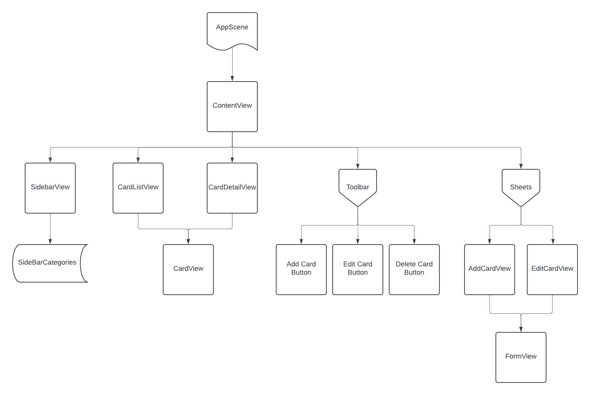

## 💳 Credit Card Wallet (macOS App)

> A native SwiftUI app to manage, track, and visualize your credit card portfolio with powerful insights and an intuitive UI.


---

## ✨ About the Project

**Credit Card Wallet** is a macOS app built using **SwiftUI** and **SwiftData**, designed to help you keep track of all your credit cards — from credit limits and annual fees to sign-up bonuses and promotional APRs.

This started as a personal project to organize a growing number of cards, and has since evolved into a full-featured app with native macOS behavior, rich visuals, and extensibility in mind.

---

## 🖥️ Features

- 💼 Track personal and business credit cards with metadata like limits, APRs, open/close status, and charge card designation
- 🖼️ Comes with over **100+ high-resolution card designs**, organized by bank
- 📊 Charts to visualize:
  - Credit limits
  - Average account age
  - Card distribution by bank
- 🕘 Editable card history with timestamped changes
- 🧰 Always-on-top utility window for quickly adding new cards
- 🧭 Sidebar navigation to switch between card categories and data insights
- 🔧 Settings panel for managing banks, processors, bonuses, and more

---

## 📸 Screenshots

### Grid View


### Card Detail View


### Charts & Insights


---




## 🧠 Planned Features

Here are some enhancements planned for future updates:

- 📄 **PDF Upload & Scan Support**  
  Upload cardmember agreements or scan physical documents with your phone. Extract and display key info like interest rates, terms, and fees.

- 🗂️ **Card Groups (Custom Folders)**  
  Create custom folders in the sidebar and drag cards into them to better organize your collection.

- 🔄 **Import/Export Functionality**  
  Export your card data as a file and re-import it on another machine or for backup purposes.

- 🍎 **Apple Wallet Integration**  
  Automatically sync new cards from Apple Wallet and pre-fill details like card art, name, and bank.

- ⚙️ **Advanced Settings**  
  More customization options — including default sort preferences, dark/light appearance toggles, and data visibility filters.

---

## 📂 File Structure

```plaintext
CreditCardLibrary/
├── Model/                  # SwiftData entities
├── Views/
│   ├── CardViews/          # UI for grid/list representations
│   ├── CardDetailViews/    # Card detail panel, history
│   ├── ChartViews/         # Bar & pie charts
│   ├── Form/               # Add/edit forms
│   └── SettingsWindow/     # Tabbed settings UI
├── Utilities/              # App storage keys, preview models
└── Assets.xcassets/        # Card artwork, logos

